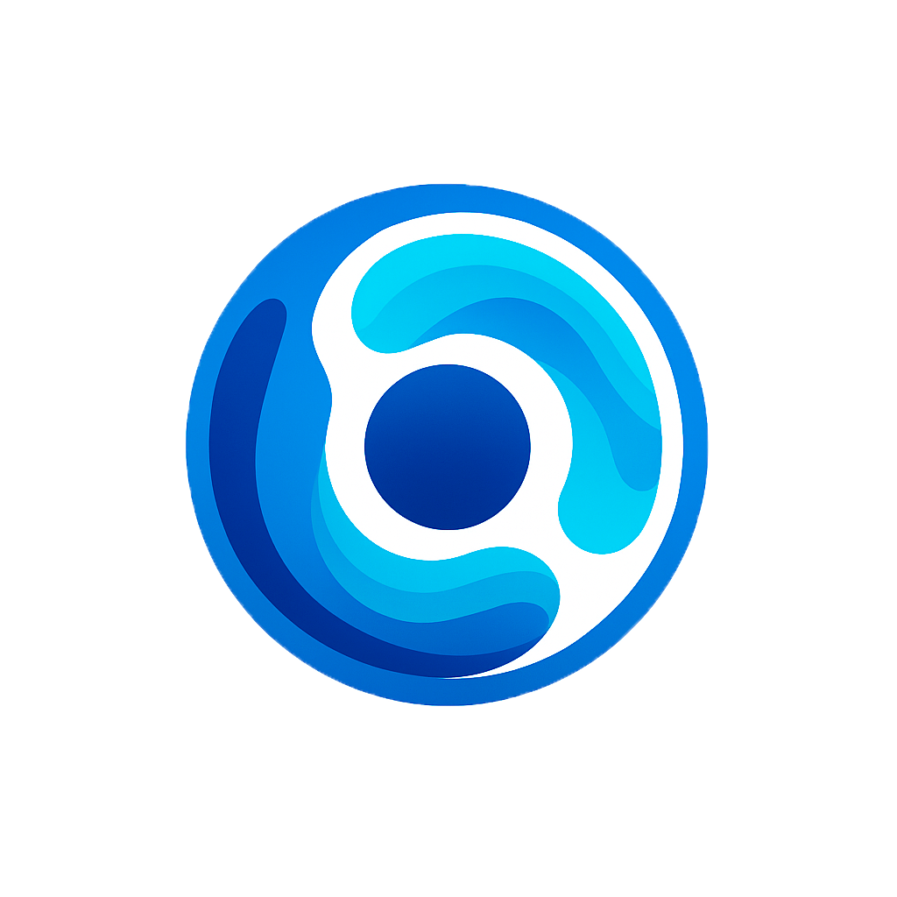

# Hemvision Demo



A service for detecting leukocyte groups in microscopic images and videos using the RT-DETR model.
It allows users to upload images and videos through a convenient web interface, process them on CPU, and receive results with bounding boxes and classes of detected cells.

---

## 🔍 Features

* **Detection model**: RT-DETR (Ultralytics) on CPU
* **Backend**: FastAPI + SlowAPI (rate limiting)
* **Frontend**: React + Vite, drag’n’drop support, progress bar, result preview
* **Containerization**: Docker & Docker Compose
* **Security**: maximum upload size limit (100 MB by default)
* **Easy integration**: ready-to-use Docker Hub images for backend and frontend

---

## 📦 Build and Run

### Requirements

* Docker CE ≥ 20.10
* Docker Compose ≥ 1.29

### Run locally

1. Clone the repository:

   ```bash
   git clone https://github.com/pumpsulp/hemvision.git
   cd hemvision
   ```

2. Start the containers:

   ```bash
   docker compose up
   ```

3. Open:

   * **Backend API** → `http://localhost:8000/docs` (Swagger UI)
   * **Frontend UI**  → `http://localhost:3000`

---

## 🚀 API Usage

### POST `/api/detect`

* **Description**: accepts a file (`image/*` or `video/*`) and returns the annotated result
* **Parameter**: `file` (multipart form)
* **Maximum size**: 100 MB (configurable)
* **Response**:

  * `image/jpeg` — annotated image
  * `video/mp4` — annotated video (H.264, inline, seek support)

cURL example:

```bash
curl -X POST http://localhost:8000/api/detect \
  -F "file=@/path/to/image.png" \
  --output result.jpg
```

---

## 🖥️ Frontend UI

* Upload via drag’n’drop or click
* Upload progress indication
* Automatic image or video preview
* Blue-cyan color scheme

Environment variables in `docker-compose.yaml`:

```yaml
frontend:
  environment:
    VITE_API_URL: "http://localhost:8000/api"
```

---

## 🗂 Project Structure

```
/
├── backend/
│   ├── Dockerfile
│   ├── requirements.txt
│   ├── main.py
│   ├── depends.py
│   ├── api/
│   │   └── detect.py
│   └── services/
│       └── inference.py
├── frontend/
│   ├── Dockerfile
│   ├── package.json
│   ├── vite.config.js
│   ├── index.html
│   ├── public/
│   │   ├── favicon.ico
│   │   └── logo.png
│   └── src/
│       ├── index.jsx
│       ├── index.css
│       ├── App.jsx
│       └── components/
│           ├── UploadCard.jsx
│           ├── PreviewCanvas.jsx
│           └── Loader.jsx
├── docker-compose.yml
└── README.md
```

---

## 📝 License

The project is distributed under the [MIT](LICENSE) license.

# Hemvision Демо


Сервис для детекции групп лейкоцитов на микроскопических изображениях и видео с помощью модели RT-DETR.
Позволяет загружать изображения и видео через удобный веб-интерфейс, обрабатывать их на CPU и получать результат с рамками и классами обнаруженных клеток.

---

## 🔍 Особенности

* **Модель детекции**: RT-DETR (Ultralytics) на CPU
* **Backend**: FastAPI + SlowAPI (rate-limit)
* **Frontend**: React + Vite, поддержка drag’n’drop, прогресс-бар, предпросмотр результата
* **Контейнеризация**: Docker & Docker Compose
* **Безопасность**: ограничение максимального размера загрузки (по умолчанию 100 МБ)
* **Простая интеграция**: готовые Docker Hub-образы для backend и frontend

---

## 📦 Сборка и запуск

### Требования

* Docker CE ≥ 20.10
* Docker Compose ≥ 1.29

### Запуск локально

1. Клонируйте репозиторий:

   ```bash
   git clone https://github.com/pumpsulp/hemvision.git
   cd hemvision
   ```
2. Запустите контейнеры:

   ```bash
   docker compose up
   ```
3. Перейдите:

   * **Backend API** → `http://localhost:8000/docs` (Swagger UI)
   * **Frontend UI**  → `http://localhost:3000`

---

## 🚀 Использование API

### POST `/api/detect`

* **Описание**: принимает файл (`image/*` или `video/*`), возвращает аннотированный результат
* **Параметр**: `file` (multipart-form)
* **Максимальный размер**: 100 МБ (конфигурируется)
* **Ответ**:

  * `image/jpeg` — аннотированное изображение
  * `video/mp4` — аннотированное видео (H.264, inline, поддержка seek)

Пример cURL:

```bash
curl -X POST http://localhost:8000/api/detect \
  -F "file=@/path/to/image.png" \
  --output result.jpg
```

---

## 🖥️ Frontend UI

* Загрузка drag’n’drop или по клику
* Индикация прогресса загрузки
* Автоматический предпросмотр изображения или видео
* Сине-голубая цветовая схема

Переменные окружения (в `docker-compose.yaml`):

```yaml
frontend:
  environment:
    VITE_API_URL: "http://localhost:8000/api"
```

---

## 🗂 Структура проекта

```
/
├── backend/
│   ├── Dockerfile
│   ├── requirements.txt
│   ├── main.py
│   ├── depends.py
│   ├── api/
│   │   └── detect.py
│   └── services/
│       └── inference.py
├── frontend/
│   ├── Dockerfile
│   ├── package.json
│   ├── vite.config.js
│   ├── index.html
│   ├── public/
│   │   ├── favicon.ico
│   │   └── logo.png
│   └── src/
│       ├── index.jsx
│       ├── index.css
│       ├── App.jsx
│       └── components/
│           ├── UploadCard.jsx
│           ├── PreviewCanvas.jsx
│           └── Loader.jsx
├── docker-compose.yml
└── README.md
```

---


## 📝 Лицензия

Проект распространяется под лицензией [MIT](LICENSE).
